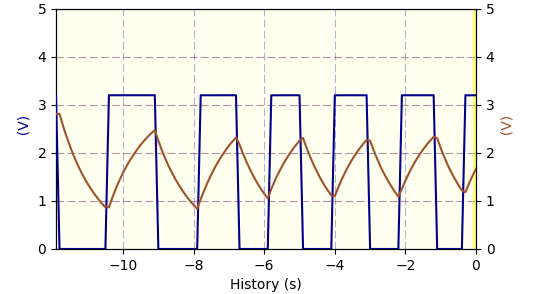

# PhyPiDAQ Software Guide

---

#### Data Acquisition and analysis for Physics education with Raspberry Pi

This is the **English** version of the documentation.

Die **deutsche Version** dieses Dokuments findet sich unter dem Link [Dokumentation_de.md](Dokumentation_de.md).

---

This *python3* code provides some basic functionality for data acquisition and visualisation like data logger, bar-chart, XY- or oscilloscope display and data recording on disk.

In addition to the GPIO inputs/outputs of the Raspberry Pi, the analogue-to-digital converters ADS1115 and MCP3008 and PicoScope USB-oscilloscopes are supported as input devices for analogue data, as well as a number of digital sensors using protocols like I²C or SPI.

The package provides an abstraction layer for measurement devices and sensors connected to a Raspberry Pi.  Dedicated classes for each device provide a simple, unified interface, containing only the methods `init(<config_dictionary>)`, `acquireData(buffer)` and `closeDevice()`. Simple examples with minimalist code illustrate the usage. The graphical user interface `phypi.py` and the script `run_phypi.py` provide a configurable environment for more complex measurements.

*Fig. 1*: Visualisation of  the time  dependence of two signals connected to an ADC  
           


## Configuration files for PhyPiDAQ

The script `run_phypi.py` allows users to perform very general measurement tasks without the need to write custom code. The options for configuration of input devices and their channels as well as for the display and data storage modules are specified in a global configuration file of type `.daq` (in `yaml` markup language), which contains references to device configuration files of type `.yaml`.

### Main configuration filelt36gb00


A typical, commented example of the main configuration file is shown below.
Note that text following a ''#''-sign is ignored and contains descriptive comments or alternatives.

**file PhyPiConf.daq**

```yaml
# -- Configuration Options for PhyPiDAQ 
# --------------------------------------

#
# -- configuration files for hardware devices 
#
DeviceFile: config/ADS1115Config.yaml    # 16 bit ADC, I2C bus
# optional: 
#DeviceFile: config/MCP3008Config.yaml   # 10 bit ADC, SPI bus
#DeviceFile: config/MCP3208Config.yaml   # 12 bit ADC, SPI bus
#DeviceFile: config/groveADCConfig.yaml  # 12 bit ADC on grove RPI shield
#DeviceFile: config/PSConfig.yaml        # PicoTechnology USB scope 
#DeviceFile: config/PL1000Config.yaml     # PicoTechnology USB series 1000 data logger 
#DeviceFile: config/MAX31865Config.yaml  # Pt 100 sensor
#DeviceFile: config/GPIOCount.yaml       # frequency count
#DeviceFile: config/DS18B20Config.yaml   # digital temperature sensor
#DeviceFile: config/MAX31855Config.yaml  # thermo element
#DeviceFile: config/BMPx80Config.yaml    # pressure/temperature sensor (BMP080 or BMP180)
#DeviceFile: config/BMP280Config.yaml    # pressure/temperature sensor
#DeviceFile: config/BMP388Config.yaml    # pressure/temperature sensor
#DeviceFile: config/BME280Config.yaml    # temperature, pressure, altitude, relative_humidity sensor
#DeviceFile: config/BME680Config.yaml    # temperature, pressure, altitude, relative_humidity; resistance proportional to VOC particle amount
#DeviceFile: config/INA219Config.yaml    # Voltage/Current sensor
#DeviceFile: config/MMA845xConfig.yaml   # Distance 
#DeviceFile: config/MMA845xConfig.yaml   # Accelerometer
#DeviceFile: config/MLX90393Config.yaml  # Magnetometer
#DeviceFile: config/TSL45315Config.yaml  # Luminance sensor

## an example of multiple devices
#DeviceFile: [config/ADS1115Config.yaml, config/GPIOCount.yaml]  

# Demo options:
#DeviceFile: ToyDataConfig.yaml          # simulated data
#DeviceFile: config/ReplayConfig.yaml    # data from File

#
# -- configuration options for Channels 
# 
ChanLabels: [U, U]                 # names for channels 
ChanUnits: [V, V]                  # units for channels 
ChanColors: [darkblue, sienna]     # channel colours in display

# eventually overwrite Channel Limits obtained from device config 
##ChanLimits: 
## - [0., 1.]   # chan 0
## - [0., 1.]   # chan 1
## - [0., 1.]   # chan 2

# calibration of channel values
#  - null    or  - <factor> or  - [ [ <true values> ], [ <raw values> ] ]
#ChanCalib: 
#  - 1.                       # chan0: simple calibration factor
#  - [ [0.,1.], [0., 1.] ]    # chan1: interpolation: [true]([<raw>] )
#  - null                     # chan2: no calibration

# apply formulae to (calibrated) channel values
#ChanFormula:
#  - c0 + c1  # chan0
#  - c1          # chan1
#  - null        # chan2 : no formula

#
# -- configuration options for graphical display 
#
Interval: 0.1                # logging interval         
#NHistoryPoints: 120          # number of points used in history buffer
DisplayModule: DataLogger    # history of channel signals
#DisplayModule: DataGraphs    # text, bar-graph, history and xy-view
#DisplayModule: null          # no graphical display 
#Title: Demo                  # display title
#XYmode:     false            # enable/disable XY-display
## if more than two channels active:
#Chan2Axes: [0, 1, 0]         # assign channels to axes
#xyPlots:                     # define which axes to show 
# - [0, 1]                    #  in xy-plot
# - [0, 2]
# - [1, 2]

#
# -- start in running or paused mode
# startActive: true  # start in running mode

#
# -- configuration options for output to file 
#
#DataFile:   testfile.csv     # file name for output file, 
DataFile:   null              #  null to disable 
#CSVseparator: ';'            # field separator, set to ';' for German Excel   

# enable buffering of latest data (depth NHistoryPoints from above)
#bufferData: PhyPiData    # file name to track latest data and eventually 
#bufferData: null         #  store them, or null to switch off  
                     
# enable output to fifo (a linux pipe) to send data to other processes
DAQfifo: null
#DAQfifo: PhyPiDAQ.fifo
```

## Device configuration files

Typical, commented examples of device configurations are shown below. The device configuration file for the analogue-to-digital converter **ADS1115** specifies the active channels, their ranges and single or differential operation modes.

**file ADS1115Config.yaml**

```yaml
# example of a configuration file for ADC ADS1115

DAQModule: ADS1115Config    # phypidaq module to be loaded

ADCChannels: [0, 3]         # active ADC-Channels
                        # possible values: 0, 1, 2, 3
                        # when using differential mode:
                        #    -  0 = ADCChannel 0 
                        #            minus ADCChannel 1
                        #    -  1 = ADCChannel 0 
                        #            minus ADCChannel 3
                        #    -  2 = ADCChannel 1 
                        #            minus ADCChannel 3
                        #    -  3 = ADCChannel 2 
                        #            minus ADCChannel 3

DifModeChan: [true, true] # enable differential mode for Channels

Gain: [2/3, 2/3]          # programmable gain of ADC-Channel
                          #   possible values for Gain:
                          #     - 2/3 = +/-6.144V
                          #     -   1 = +/-4.096V
                          #     -   2 = +/-2.048V
                          #     -   4 = +/-1.024V
                          #     -   8 = +/-0.512V
                          #     -  16 = +/-0.256V
sampleRate: 860           # programmable Sample Rate of ADS1115
                          #    possible values for SampleRate: 
                          #    8, 16, 32, 64, 128, 250, 475, 860
```

The **USB-oscilloscope** PicoScope can also be used as data logger. In this case the average of a large number of measurements at high rate is taken. Choosing a measurement time of 20 ms very effectively eliminates 50 Hz noise.

**file PSconfig.yaml**

```yaml
# example of a configuration file for PicoScope 2000 Series

DAQModule: PSConfig

PSmodel: 2000a

# channel configuration 
picoChannels: [A, B]
ChanRanges: [2., 2.]
ChanOffsets: [-1.95, -1.95]
ChanModes: [DC, DC]
sampleTime: 2.0E-02
Nsamples: 100

# oscilloscope trigger
trgActive: false  # true to activate
trgChan: A
#trgThr: 0.1
#pretrig: 0.05
#trgTyp: Rising
#trgTO: 1000  # time-out

# internal signal generator 
# frqSG: 100.E+3 # put 0. do disable
frqSG: 0.

```

Examples of other devices like the analog-to-digital converter MCP3008, of rate measurements via the GPIO pins of the Raspberry Pi or temperature measurements with the 1-wire digital thermometer DS18B20,   PT100 sensors and the resistance-to-digital converter MAX31865 or thermocouples and the thermocouple-to-digital converter MAX31855 are also contained in the configuration directory, see files `MCP3008Config.yaml`, `GPIOcount.yaml`, `DS18B20Config.yaml` , `MAX31865Config.yaml` or `MAX31855Config.yaml`, respectively.

## Installation of PhyPiDAQ on a Raspberry Pi


**Obtaining the PhyPiDAQ code and simple installation**

The installation works on Raspberry Pis with Debian 11 (Bullseye) or 
12 (Bookworm) as operating system. Please note that your Raspberry Pi must be 
connected to the must be connected to the Internet for the following steps. 

With the command *git* you can download all files of the package `PhyPiDAQ`. 
To install *git*, after setting up your Raspberry Pi, enter the following command 
in the console window:

```bash
  sudo apt-get install git
```

To install `PhyPiDAQ`, enter the following commands : 

1. transfer files from github: 
     ```bash
        mkdir ~/git
        cd ~/git
        git clone https://github.com/PhyPiDAQ/PhyPiDAQ
      ```

2. *PhyPiDAQ* is based on code from other packages that provide the drivers for the supported
   devices and libraries for visualization. The commands required to install them are 
   summarized in the `installlibs.sh` script.  Enter the following on the command line 
   (without the explanatory text after the `#` sign):

     ```bash
        cd ~/git/PhyPiDAQ # change to the installation directory
        git pull # optional, if you want to update PhyPiDAQ
       ./installlibs.sh # execute installation script
     ```

     During the installation process, you will be asked whether the sensor drivers should be installed. They are not required to run the demo and some applications, but are needed
     to use sensors connected to the GPIO pins of the Raspberry Pi. In addition, the script
     prompts whether the PicoScope drivers should be installed. This is only necessary   
     on the Raspberry Pi, as on other systems the libraries are installed together with the
     PicoScope software.

3. A virtual *Python* environment is required for the latest Linux version. For PhyPiDAQ 
    this is provided system-wide for each user in the directory `/usr/local/share/phypy/`. 
    This script also initializes a working directory in the user's home directory
    with local copies of the configuration files from the installation directory. 
    On a Raspberry Pi, desktop icons are also created. Type  

    ```bash
       # Create a working directory PhyPi and copy examples and 
       # configuration files into the newly created directory.
       cd ~/git/PhyPiDAQ
       ./install_user.sh [<directory name>]  
       # the entry of a directory name is optional; the default is “PhyPi”
    ```

4. It is also necessary to activate the virtual *Python* environment at each login, 
    by executing the following  
   
    ```shell
       cd 
       source activate_phypi.sh
    ```

    If the exclusive use of *PhyPiDAQ* is intended on a system, the command
    command can also be included in the user's `.bashrc` file. 
  
This completes the installation and *PhyPiDAQ* is ready for its first use. 
To test it, change to the working directory, `cd PhyPi` and execute the 
*PhyPiDAQ* demo, either by entering `phypi.py` or by double-clicking on 
the `phypi_demo` icon. This will start the application to play back recorded 
data in a window as specified in the configuration file `PhyPiDemo.daq`.

If PhyPiDAQ is already installed on a system but needs to be updated, please
enter the following:
  ```bash
    cd ~/git/PhyPiDAQ
    git pull
  ```
and then carry out steps 2 to 4.  


**Get PhyPiDAQ code and dependencies**

Attention, the installation procedure described here requires the legacy version
(Debian 11, bullseye) to be installed on your Raspberry Pi!

After setting up your Raspberry pi with the most recent version of the Debian Release *stretch*, enter the following commands in the console window:

```bash
mkdir git
cd git
git clone https://github.com/PhyPiDAQ/PhyPiDAQ
```

For your convenience, the script `installlibs.sh` installs all components needed for PhyPiDAQ. Simply execute
the script `installlibs.sh` once on the command line (without text after `#`):

```bash
cd ~/git/PhyPiDAQ  # change to installation directory 
git pull           # eventually update to latest version of PhyPiDAQ
./installlibs.sh  
```

The installation is now done and *PhyPiDAQ* is ready to be used.

The last part of the installation procedure is also valid to update an exiting version of `PhyPiDAQ` .

To test the installation without connected hardware or on a system other than the Raspberry Pi, PhyPiDAQ
may be started in demo-mode:

```bash
cd ~/git/PhyPiDAQ  # change to installation directory
./run_phypi.py     # execute run_phypi.py with configuration PhyPiDemo.daq
```

**Remark**

*PhyPiDAQ* is meant to be an educational tool.  Confronting students with the full contents of this package is therefore
not appropriate. Instead, it is recommended to create a working directory and copy examples from there to the student's 
working directory. This is achieved via the following commands:

```bash
# create PhyPi working directory and make examples and config files available
cd ~/git/PhyPiDAQ
./install_user.sh [<directory name>] # the input of a directory name is optional; default is "PhiPi"
```

You might also consider moving the *PhyPiDAQ* package to system space, e.g. /usr/local:

```bash
sudo mv ~/git/PhyPiDAQ /usr/local/
```

Please note that the paths in the example above must be adjusted in this case, e.g. ´~/git/` -> /usr/local/.
The paths in *~/Desktop/phypi.desktop* must also be changed appropriately. This is most easily achieved by
right-clicking the icon and use of the dialog "Properties".

### Dependencies on external packages

A complete list of [dependencies](Dependencies.md) can be found in [Dependencies.md](Dependencies.md).

For convenience, installation files for some external packages and for modules of this package
in pip wheel format are provided in subdirectory *./installlibs*.

For completeness, the steps performed by the script `installlibs.sh` are documented here:

```bash
#
# script to install libraries PhyPiDAQ depends on
#
# -----------------------------------------------

sudo apt-get install python3-yaml
sudo apt-get install python3-scipy
sudo apt-get install python3-matplotlib
sudo apt-get install python3-pyqt5
sudo apt-get install libatlas-base-dev # needed to build nupmy

sudo pip3 install installlibs/whl/*.whl # python wheels

sudo pip3 install installlibs/tgz/*.tar.gz # python packages 

sudo dpkg -i installlibs/picoscopelibs/*.deb # picoscope 
sudo usermod -a -G tty pi # grant access to USB for user pi
```

The drivers for PicoScope oscilloscopes may also be installed from the repository of the vendor, which is included as follows:

1. Open file /etc/apt/sources.list by `sudo nano /etc/apt/sources.list`.   
    
2. Use arrow keys to navigate to the next free line and add entry `deb http://labs.picotech.com/raspbian/ picoscope main` to  /etc/apt/sources.list.  
    
3. Save file /etc/apt/sources.list by `Ctrl + O` and `Enter`.
4. Close /etc/apt/sources.list by `Ctrl + X`.

Now the drivers for the various PicoScope devices can be included end eventually updated with *apt-get*:

```bash
wget -O - http://labs.picotech.com/debian/dists/picoscope/Release.gpg.key | sudo apt-key add -
sudo apt-get update
sudo apt-get install libps2000
sudo apt-get install libps2000a

# allow access of user pi to usb port
sudo usermod -a -G tty pi
```

## Overview of files contained in PhyPiDAQ 

An introduction to the file structure of PhyPiDAQ, including lists of all examples and more can be found in
[PackageStructure.md](PackageStructure.md).

## Developer guides

The developer guides provide useful information on the following toppics

- Release notes of the package can be found in the [ReleaseNotes.md](../ReleaseNotes.md) of the root folder.
- Information about the version schema can be found in [ReleaseGuide.md](ReleaseGuide.md).
- A usage guide of external QT tools can be found in [Resources.md](Resources.md), describing the updating icon 
  resources and the graphical user interface (GUI).
